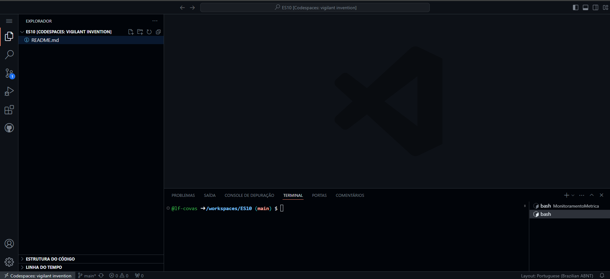
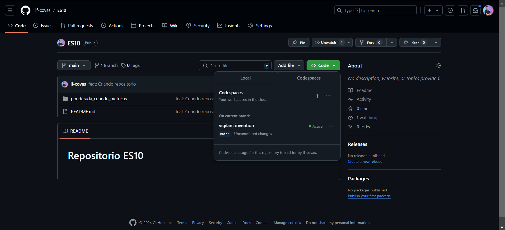
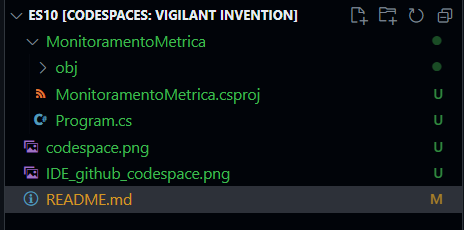
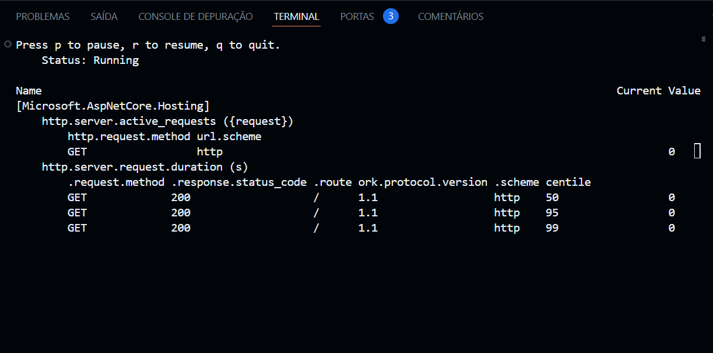
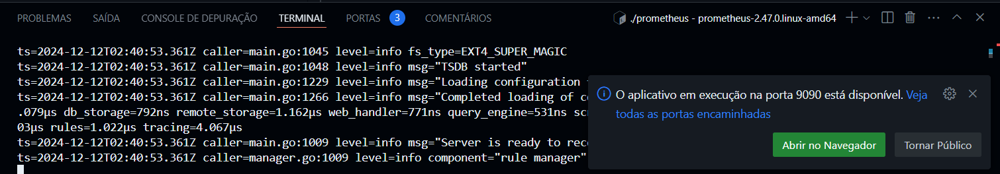
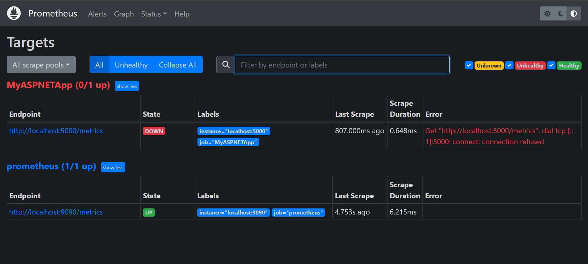
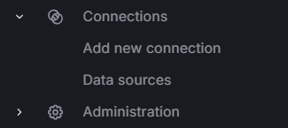
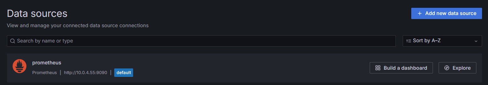
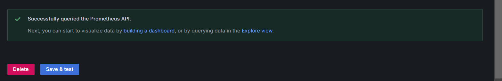
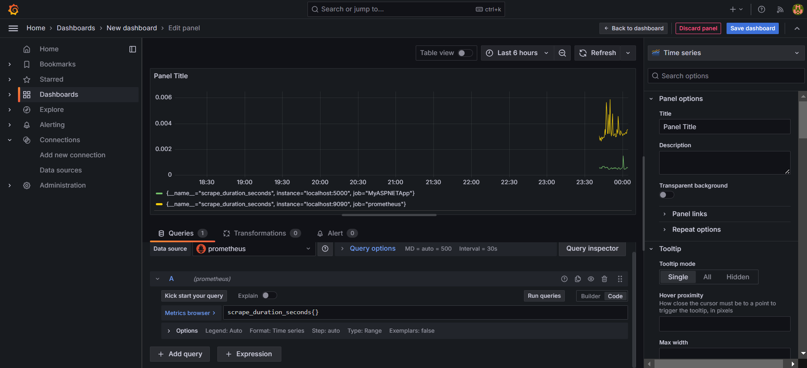

# Ponderada coletando metricas v2

## Configuração do app
Crie um repositorio novo no Github para fazermos uso do Github codespace.



Ao abrir o codespace você verá uma tela como abaixo:



Abra o terminal e execute o comando abaixo para a criação de um app em dotnet:

```
dotnet new web -o WebMetric
```

Você verá que alguns arquivos foram instalados em seu projeto:



Adicione os pacotes de openTelemetry ao seu aplicativo com os comandos abaixo:

```
dotnet add package OpenTelemetry.Exporter.Prometheus.AspNetCore --prerelease
dotnet add package OpenTelemetry.Extensions.Hosting
```

Agora, substitua o conteudo do seu arquivo `Program.cs` pelo conteudo abaixo:

```
using OpenTelemetry.Metrics;

var builder = WebApplication.CreateBuilder(args);
builder.Services.AddOpenTelemetry()
    .WithMetrics(builder =>
    {
        builder.AddPrometheusExporter();

        builder.AddMeter("Microsoft.AspNetCore.Hosting",
                         "Microsoft.AspNetCore.Server.Kestrel");
        builder.AddView("http.server.request.duration",
            new ExplicitBucketHistogramConfiguration
            {
                Boundaries = new double[] { 0, 0.005, 0.01, 0.025, 0.05,
                       0.075, 0.1, 0.25, 0.5, 0.75, 1, 2.5, 5, 7.5, 10 }
            });
    });
var app = builder.Build();

app.MapPrometheusScrapingEndpoint();

app.MapGet("/", () => "Hello OpenTelemetry! ticks:"
                     + DateTime.Now.Ticks.ToString()[^3..]);

app.Run();
```

Como estamos utilizando o ambiente de codespace o dotnet-counters já está instalado. Portanto podemos iniciar o nosso aplicativo para realizar a primeira coleta atráves do comando `dotnet run` dentro da pasta WebMetric.

Assim que o arquivo iniciar, execute em uma outra aba do seu terminal o comando abaixo:

```
dotnet-counters monitor -n WebMetric --counters Microsoft.AspNetCore.Hosting
```

Você deverá visualizar em seu terminal uma imagem como essa:



## Configuração do Prometheus
No terminal do Codespaces, execute o seguinte comando para baixar o Prometheus:

```
wget https://github.com/prometheus/prometheus/releases/download/v2.47.0/prometheus-2.47.0.linux-amd64.tar.gz
```

Para extrair os arquivos, utilize o comando abaixo:

```
tar -xvf prometheus-2.47.0.linux-amd64.tar.gz
```

Navegue até o diretório extraído e execute o comando abaixo para mover para um diretório permanente:

```
cd prometheus-2.47.0.linux-amd64
```

Para configurar o arquivo `prometheus.yml` abra o arquivo de configurações do Prometheus com o seguinte comando:

```
nano prometheus.yml
```

 Substitua o conteúdo por:

 ```yml
 global:
  scrape_interval: 15s
  evaluation_interval: 15s

scrape_configs:
  - job_name: 'prometheus'
    static_configs:
      - targets: ['localhost:9090']

  - job_name: 'MyASPNETApp'
    scrape_interval: 5s
    static_configs:
      - targets: ['localhost:5000'] # Substitua pela porta onde seu app está rodando    
 ```

Execute o Prometheus com o código abaixo:

```
./prometheus --config.file=prometheus.yml
```

Após rodar esse comando você verá um pop up do canto inferior direito dizendo que o aplicativo está disponivel na porta 9090 como mostra imagem abaixo:



Ao abrir no navegador, acesse status > Target e você verá uma imagem como abaixo, mostrando o funcionamento da coleta:



## Configurando Grafana

No terminal, execute o comando abaixo para baixar e iniciar o Grafana utilizando o Docker:

```
docker run -d -p 3000:3000 --name grafana grafana/grafana-oss:latest
```

Caso o container esteja parado, reinicie-o com o seguinte comando:

```
docker start grafana
```

Ao acessar o Grafana acesse connections e seleciona Data Sources.



Então, selecione o Prometheus como seu Data source:



Execute `ipconfig` para localizar o ip do codespace e adicionar no Grafa.

Com o numero do IP, finalize a configuração do Grafana da seguinte maneira:

`http://<IP_DO_CODESPACE>:9090
`

Clique em Salvar



Pronto, agora é só colocar as metricas para serem disponibilizadas via Dashboard:

